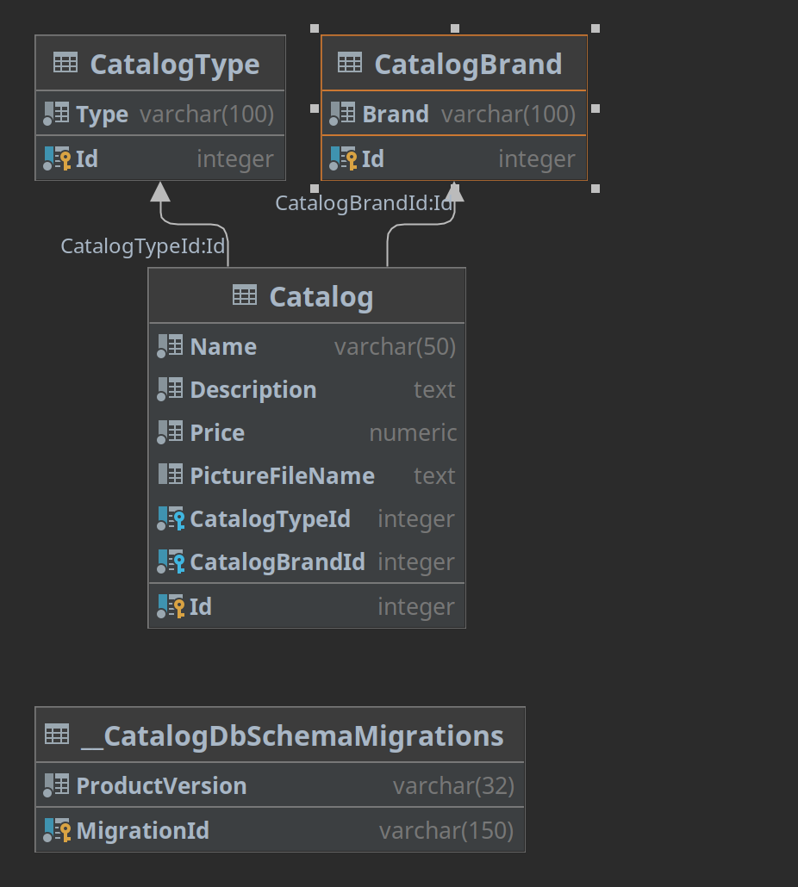

# TCC.Catalog.Persistence.Postgres.EntityFrameworkCore
Livraria que contem as configuracões do banco de dados e as suas migracões.

Será utilizado o patter Code First por meio da lib .NET EntityFrameworkCore

# Pre-requisitos
- docker run --name tcc-senai-postgres -p 5432:5432 -e POSTGRES_PASSWORD=tccsenaipa55w0rd -d postgres
- dotnet tool install --global dotnet-ef

# Migracoes

## Criar a primeira migration
```bash
cd TCC.Catalog.Persistence.Postgres.EntityFrameworkCore
dotnet ef migrations add Init
```

## Adicionar novas migracoes
```bash
cd TCC.Catalog.Persistence.Postgres.EntityFrameworkCore
dotnet ef migrations add <MigrationName>
```

## Remover última migracão
```bash
cd TCC.Catalog.Persistence.Postgres.EntityFrameworkCore
dotnet ef migrations remove
```

# ER Model

